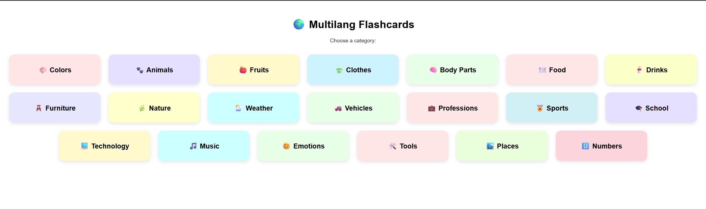
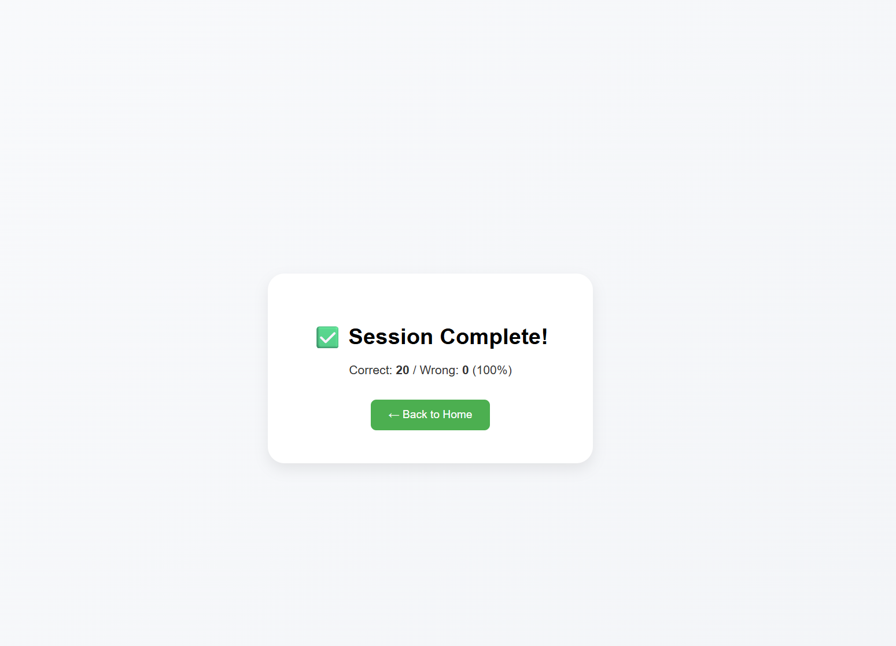

# 🧠 Multilang Flashcards

An interactive bilingual flashcard web app designed to help users **learn German vocabulary** through repetition and recall.  
Each flashcard shows a **German word** on the front and reveals its **English translation** when flipped.

---

## 🌍 Overview

The app provides 20 categories (e.g., Colors, Animals, Food, Technology, Emotions...) — each with 20 bilingual word pairs.  
Users can select a topic, go through flashcards, and track their progress.

### 🏠 Home Page  
Users start by selecting a vocabulary category.  
Each category tile has a unique color and emoji for visual association.

<p align="center">
  
</p>

---

## 🔄 Flashcard Learning Flow

Once a category is selected, flashcards appear one by one.

### 🃏 Flashcard Front  
Displays the **German** term.

<p align="center">
  
</p>

### 🔁 Flashcard Back  
Flipping the card reveals the **English** translation.

<p align="center">
  
</p>

Users can then mark whether they **knew (✓)** or **didn’t know (✗)** the word.  
Unknown words are re-queued to appear again — encouraging natural reinforcement.

---

## 📊 Session Completion

After all cards are answered, the user sees their **session summary** with correct/wrong counts and accuracy.

<p align="center">
  
</p>

---

## ⚙️ Architecture & Tech Stack

### **Frontend**
- **React + Vite**  
- **React Router DOM** for navigation  
- **Inline CSS styles** (no framework, lightweight)
- Configurable backend endpoint via `.env` (`VITE_BACKEND_URL`)

### **Backend**
- **FastAPI (Python)**  
- **SQLAlchemy ORM + SQLite**  
- REST endpoints for `/domains` and `/terms`  
- CORS enabled for local dev (`localhost:5173`)

---

## 🧩 Project Structure

```plaintext
multilang-flashcards/
│
├── backend/
│   ├── main.py              # FastAPI entrypoint
│   ├── models.py            # SQLAlchemy models (Domain, Term)
│   ├── schemas.py           # Pydantic schemas
│   ├── crud.py              # CRUD operations
│   ├── database.py          # DB engine + session
│   ├── seed_data.py         # Preloads 20 categories × 20 terms
│   └── wordcards.db         # Auto-generated SQLite database
│
├── frontend/
│   ├── src/
│   │   ├── App.jsx          # Home screen with categories
│   │   ├── Flashcards.jsx   # Card logic + scoring
│   │   └── utils/cache.js   # Cached fetch helpers
│   └── .env                 # Backend URL config
│
└── figures/
    ├── mainpage.png
    ├── flashcard.png
    ├── flashcard_back.png
    └── result.png

```

---

## 🚀 Run Locally

### Backend
```bash
cd backend
python -m venv venv
venv\Scripts\activate
pip install fastapi uvicorn sqlalchemy
uvicorn main:app --reload
```
### Frontend
```bash
cd frontend
npm install
npm run dev
```


Then visit 👉 http://localhost:5173

### Purpose

The goal is to support German vocabulary learning through a minimal, intuitive interface:

Recall practice with dual-sided flashcards

Color-coded, emoji-aided category recognition

Automatic spaced repetition for missed words

### Future Enhancements

🔊 Add text-to-speech pronunciation

📈 User streaks and difficulty levels

📱 PWA (mobile-friendly offline mode)

🌐 Multi-language expansion (English ↔ Turkish ↔ German)
